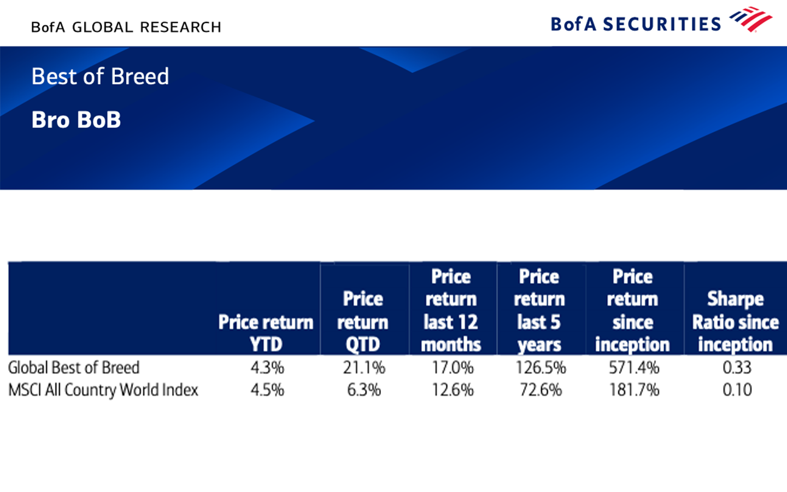

# BEST-OF-BREED — Fundamental Screener (CSV → Weights)

Reads a fundamentals CSV, validates the schema, and produces market-cap–weighted outputs.

<!-- CI badge (appears after you add .github/workflows/ci.yml) -->

## Features
- Robust CSV loading & basic type normalization
- Schema validation:
  - **Base** columns are required (hard check)
  - **NF/FIN** columns are optional (warnings only)
- Market-cap weighting with sorted output
- Clear outputs saved under `outputs/`

## Quick start

# macOS / Linux
python3 -m venv .venv
source .venv/bin/activate

# Windows (PowerShell)
python -m venv .venv
.venv\Scripts\Activate.ps1

python -m pip install --upgrade pip
python -m pip install -r requirements.txt

python screen.py --input data/fundamentals.csv --outdir outputs
